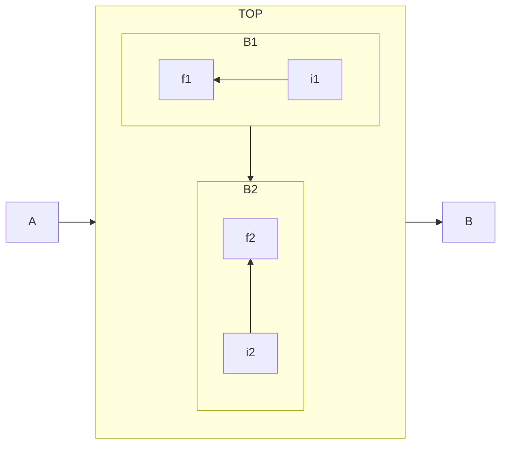
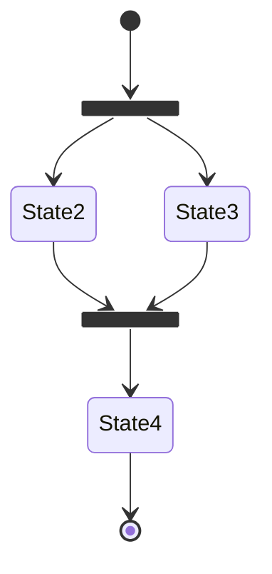
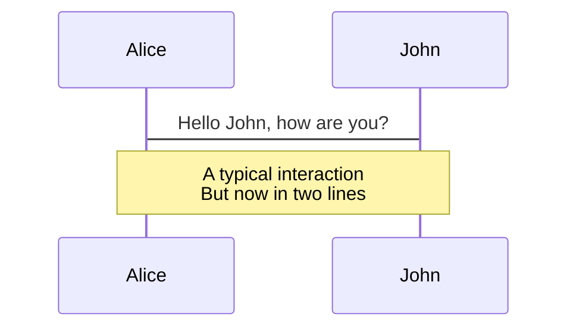
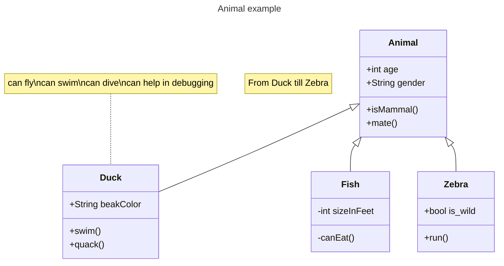
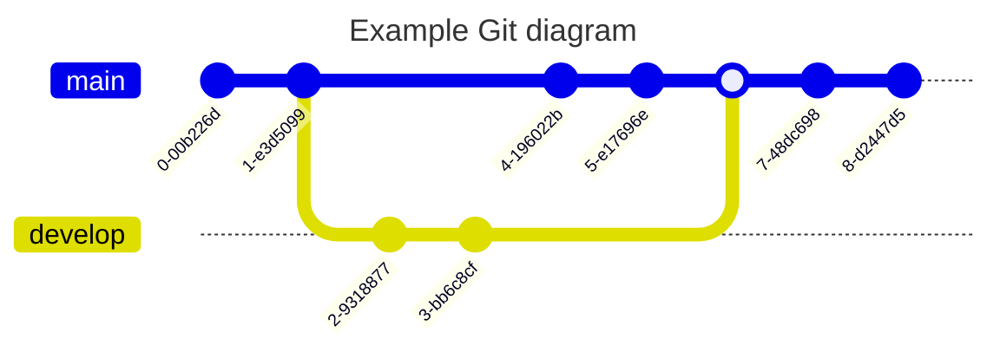

## 图表一览

|图表名称|图表用途|文档链接|
|---|---|---|
|[Flowchart](#flowchart)|流程图、分支图|[Flowcharts - Basic Syntax](https://mermaid.js.org/syntax/flowchart.html)|
|[State](#state)|状态转移（流程）图|[Flowcharts - Basic Syntax](https://mermaid.js.org/syntax/flowchart.html)|
|[Sequence](#sequence)|强调物体间通信关系|[Sequence diagrams](https://mermaid.js.org/syntax/sequenceDiagram.html)|
|[Class](#class)|类属性及继承关系|[Class diagrams](https://mermaid.js.org/syntax/classDiagram.html)|
|[Gitgraph](#gitgraph)|版本历史记录、线路图|[Gitgraph Diagrams](https://mermaid.js.org/syntax/gitgraph.html)|

- Statechart 相较于传统流程图支持专属于状态的特殊的操作，例如 Fork-join.

### Flowchart

### State

### Sequence

### Class

### Gitgraph

