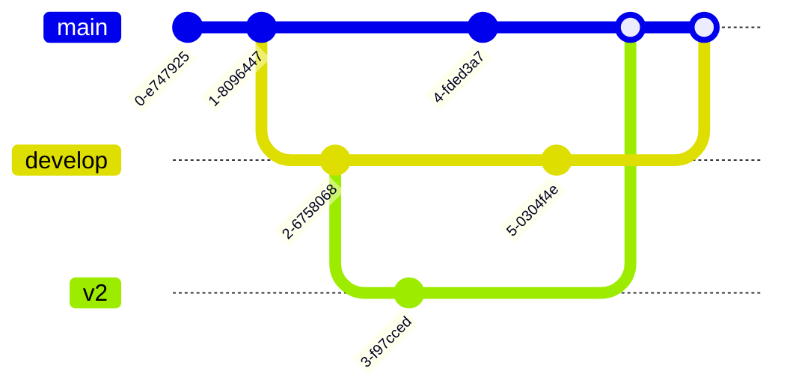

## 不同分支之间关系

## 不同存储地点之间关系

## 版本控制流程图

## Reference
- [Git 版本控制 常用篇](https://medium.com/daai/git-%E7%89%88%E6%9C%AC%E6%8E%A7%E5%88%B6%E4%B8%80%E4%B8%8B%E5%90%A7-6e26fc432b16)
- [Git 工作流与规范](https://shockerli.net/post/git-flow-guide/)